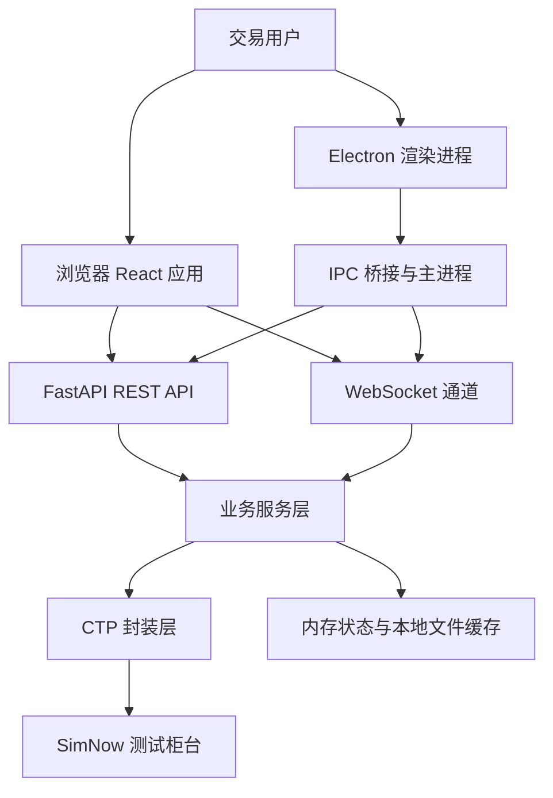
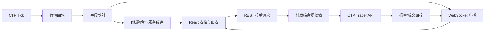

# 上期所 SimNow 模拟交易终端

> 基于 CTP 协议的浏览器与 Electron 双模式期货期权模拟交易终端。

---

## 项目简介

本项目面向需要接入上期所 SimNow 测试环境的交易研发、量化学习和交易系统测试场景，提供一套可直接运行的行情与交易终端。它将 CTP 原生行情/交易接口封装为 FastAPI REST API 与 WebSocket 数据流，再由 React 前端统一呈现；同一套前端代码既可以运行在浏览器中，也可以打包为 Electron 桌面应用。

项目重点解决三个问题：CTP 回调接口难以直接被浏览器消费、实时行情与报单状态需要稳定地双向同步、交易指令需要在前后端同时进行合规校验。业务数据默认只保存在运行时内存中，适合作为模拟交易、接口联调和终端原型的基础，不应直接用于真实资金交易。

## 核心能力

### 实时行情与合约浏览

- **功能**：接入 CTP 行情，提供合约搜索、行情表格、五档深度、快照、按需订阅和预置合约刷新。
- **解决的问题**：避免在浏览器中直接处理 CTP 原生回调和连接生命周期。
- **价值**：通过 WebSocket 推送实时数据，并使用 VTable 虚拟滚动承载大量合约。

### K 线与技术指标

- **功能**：后端根据 tick 聚合 1m、5m、15m、30m、1h 和日线 OHLCV 数据，前端支持 MA、BOLL、成交量、MACD、KDJ、RSI。
- **解决的问题**：SimNow 测试环境没有为本项目提供历史 K 线接口。
- **价值**：在无历史数据服务的前提下提供实时分析能力，并对数据不足场景进行降级处理。

### 手动报单与止损管理

- **功能**：支持限价、市价、止损、套利、点价、一键反向和锁仓等操作，并提供撤单、批量撤单和止损单管理。
- **解决的问题**：将交易规则校验前移，降低非法数量、保护价和价格跳动导致的报单错误。
- **价值**：前端提供交互反馈，后端通过 Pydantic 和业务服务进行最终校验。

### 账户与交易查询

- **功能**：查询持仓、资金、报单、成交、合约、期权链和波动率信息。
- **解决的问题**：将 CTP 查询回调转换为前端可消费的统一数据模型。
- **价值**：行情、交易、查询和连接状态在同一个终端中闭环。

### 浏览器与桌面双模式

- **功能**：浏览器开发模式与 Electron 桌面模式共享 React 页面；桌面端提供多窗口、系统托盘、全局快捷键、原生通知、后端进程管理和自动更新能力。
- **解决的问题**：同时覆盖快速联调和接近传统交易软件的桌面使用体验。
- **价值**：减少两套 UI 的维护成本，并支持 Windows、macOS、Linux 打包。

## 效果展示

当前仓库未提供可公开访问的在线 Demo 或截图。

<!-- TODO: 添加行情表格、K 线图、报单面板和 Electron 桌面端截图或 GIF。 -->

## 应用场景

- **CTP 接口学习**：使用 SimNow 测试账号观察行情、报单和回报链路。
- **交易终端原型**：验证行情表格、K 线、报单面板和多窗口交互设计。
- **前后端联调**：通过 REST API 与 WebSocket 检查 CTP 字段映射和业务状态同步。
- **交易规则测试**：验证数量上限、保护价、价格跳动和止损流程等前后端校验。
- **桌面应用开发**：验证 Electron 窗口管理、托盘、快捷键、通知和自动更新能力。

## 安装部署

### 环境要求

- Python 3.10+，建议使用虚拟环境。
- Node.js 18+ 与 npm。
- 可访问 SimNow 测试环境的网络。
- SimNow 测试账号；账号可在 [SimNow 官网](https://www.simnow.com.cn/) 注册。
- `ctp-python` 及其本地 CTP 运行依赖。首次安装或跨平台部署时，请先确认当前平台与 CTP 二进制包兼容。

### 方式一：让 AI 协助安装

将下面的提示词粘贴给你的 AI 编码工具，并在项目根目录执行：

```text
请帮我安装并启动当前 SimNow 模拟交易终端：
1. 检查 Python、Node.js、CTP 原生依赖和 SimNow 配置；
2. 在 server/ 安装 requirements.txt，在 frontend/ 安装 npm 依赖；
3. 将 server/.env.sample 复制为 server/.env，并提示我填写 SimNow 账号密码；
4. 分别启动后端和前端，确认 http://localhost:5173 可以访问；
5. 运行后端与前端测试，报告失败项及原因。
```

### 方式二：命令行安装

```bash
git clone <repository-url>
cd keti

# 后端
python -m venv .venv
# macOS/Linux: source .venv/bin/activate
# Windows PowerShell: .venv\Scripts\Activate.ps1
python -m pip install -r server/requirements.txt
cp server/.env.sample server/.env       # Windows 可手动复制

# 前端
cd frontend
npm install
```

编辑 `server/.env`，至少填写：

```dotenv
CTP_USER_ID=你的SimNow账号
CTP_PASSWORD=你的SimNow密码
```

### 方式三：手动安装

1. 安装 Python、Node.js，并确认 `python --version`、`node --version` 可用。
2. 在 `server/` 执行 `python -m pip install -r requirements.txt`。
3. 在 `frontend/` 执行 `npm install`。
4. 复制 `server/.env.sample` 为 `server/.env`，填写账号密码和需要覆盖的 CTP 前置地址。
5. 按“快速开始”分别启动后端和前端。

### 安装验证

```bash
cd server
python -m pytest tests/ -v

cd ../frontend
npm test
npm run build
```

测试命令用于验证项目代码；真正连接 SimNow 还需要有效账号、可用网络和处于可连接的测试环境。

## 快速开始

### 浏览器模式

打开两个终端：

```bash
# 终端一
cd server
python start.py

# 终端二
cd frontend
npm run dev
```

然后访问 <http://localhost:5173>，在连接面板中登录或等待后端启动连接。

### Electron 模式

```bash
cd frontend
npm run electron:dev
```

Electron 开发模式会启动 Vite，编译主进程，并通过 `BackendManager` 管理后端进程。

## 使用说明

### 后端命令

```bash
cd server
python start.py              # 自动选择 CTP 前置地址并监听 8000 端口
python start.py --reload     # 开发模式
python start.py --port 8001  # 自定义端口
```

`start.py` 会根据当前时间在标准仿真环境和 7×24 环境之间选择前置地址。非交易时段连接成功但没有行情推送，可能是 SimNow 环境的正常行为。

### API 与 WebSocket

| 类型 | 路径 | 用途 |
|------|------|------|
| REST | `/api/connection` | 登录、登出、连接状态 |
| REST | `/api/market` | 合约、订阅、快照、深度、K 线、期权和波动率 |
| REST | `/api/order` | 报单、撤单、反向、锁仓和止损 |
| REST | `/api/query` | 持仓、资金、报单、成交和合约查询 |
| WebSocket | `/ws/market` | 实时行情与订阅状态 |
| WebSocket | `/ws/order` | 报单回报与成交回报 |
| WebSocket | `/ws/position` | 持仓变化 |
| WebSocket | `/ws/stop` | 止损单状态与触发事件 |
| WebSocket | `/ws/system` | 连接状态、心跳和系统事件 |

启动后可访问 FastAPI 自动文档：<http://127.0.0.1:8000/docs>。

### Electron 快捷键

| 快捷键 | 功能 |
|--------|------|
| `Ctrl+B` | 快速打开报单 |
| `Ctrl+K` | 打开 K 线图 |
| `Ctrl+Q` | 退出应用 |
| `Ctrl+Shift+M` | 切换性能监控 |

## 系统架构

### 原始运行模式架构

项目支持两种运行模式，共享同一套前端代码和后端服务：

```
┌─────────────────────────────────────────────────────────────────────────────┐
│  模式一：Web 浏览器                                                          │
│  ┌─────────────────────────────────────────────────────────────────────┐    │
│  │  浏览器 (Chrome/Edge/Firefox)                                       │    │
│  │  └─ React + TypeScript + vtable + ECharts                          │    │
│  └─────────────────────────────────────────────────────────────────────┘    │
│                          ↕ HTTP/WS (localhost:5173)                         │
└─────────────────────────────────────────────────────────────────────────────┘

┌─────────────────────────────────────────────────────────────────────────────┐
│  模式二：Electron 桌面应用                                                    │
│  ┌─────────────────────────────────────────────────────────────────────┐    │
│  │  Electron 主进程                                                     │    │
│  │  ├─ WindowManager (多窗口管理)                                       │    │
│  │  ├─ TrayManager (系统托盘)                                           │    │
│  │  ├─ ShortcutManager (全局快捷键)                                     │    │
│  │  ├─ NotificationManager (原生通知)                                   │    │
│  │  ├─ BackendManager (后端进程管理)                                    │    │
│  │  └─ AutoUpdater (自动更新)                                           │    │
│  └─────────────────────────────────────────────────────────────────────┘    │
│                          ↕ IPC                                              │
│  ┌─────────────────────────────────────────────────────────────────────┐    │
│  │  Electron 渲染进程 (React 应用)                                       │    │
│  │  └─ 与 Web 模式共享同一套代码                                         │    │
│  └─────────────────────────────────────────────────────────────────────┘    │
│                          ↕ HTTP/WS                                          │
└─────────────────────────────────────────────────────────────────────────────┘

┌─────────────────────────────────────────────────────────────────────────────┐
│  共享后端服务                                                                 │
│  ┌─────────────────────────────────────────────────────────────────────┐    │
│  │  Python 中间层 (FastAPI)                                             │    │
│  │  ├─ REST API (/api/*)                                               │    │
│  │  ├─ WebSocket (/ws/*)                                               │    │
│  │  └─ CTP 封装层 (ctp-python SWIG)                                    │    │
│  └─────────────────────────────────────────────────────────────────────┘    │
│                          ↕ CTP 协议                                         │
│  ┌─────────────────────────────────────────────────────────────────────┐    │
│  │  CTP DLL (行情/交易前置)                                              │    │
│  └─────────────────────────────────────────────────────────────────────┘    │
│                          ↕                                                  │
│  ┌─────────────────────────────────────────────────────────────────────┐    │
│  │  SimNow 柜台 (7×24 测试环境)                                         │    │
│  └─────────────────────────────────────────────────────────────────────┘    │
└─────────────────────────────────────────────────────────────────────────────┘
```

### 原始数据流

```
行情数据流：CTP → Python → WebSocket → React → 表格/图表
报单数据流：React → REST API → Python → CTP → 回报 → WebSocket → React
查询数据流：React → REST API → Python → CTP → 缓存 → React
```



| 模块 | 职责 |
|------|------|
| React 前端 | 行情、K 线、报单、查询、期权和标签页交互 |
| Electron 主进程 | 窗口、托盘、快捷键、通知、后端进程和自动更新 |
| FastAPI | REST 路由、生命周期、CORS 和统一异常处理 |
| WebSocket 管理器 | 客户端连接、心跳、频道广播和实时事件推送 |
| 业务服务层 | 行情聚合、订单管理、止损、查询、期权和重连 |
| CTP 封装层 | SWIG API、SPI 回调、字段转换与连接状态 |
| SimNow | 提供模拟行情、交易和查询服务 |

## 核心工作流程



1. CTP 行情 SPI 接收 tick，并通过字段映射转换为前端统一的 camelCase 数据。
2. 行情服务更新快照、深度和实时 K 线，同时由 WebSocket 管理器广播给客户端。
3. 前端提交报单或查询请求，服务端进行数量、价格、保护价和业务状态校验。
4. CTP Trader API 发出请求并接收回报，订单、成交、持仓和止损事件通过对应频道返回前端。

## 交易合规校验

项目按上期所交易指令约束实现前后端双重校验：

| 指令类型 | 期货上限 | 期权上限 | 规则 |
|----------|----------|----------|------|
| 限价指令 | 500 手 | 100 手 | 支持 GFD、FOK、FAK |
| 市价指令 | 60 手 | 30 手 | 必须填写保护价 |
| 止损单 | 500 手 | 100 手 | 支持限价/市价触发 |
| 套利指令 | 500 手 | — | 使用 CTP 原生 SP 合约 |

市价指令的保护价必须在涨跌停范围内，并按 `priceTick` 整数倍对齐；后端 Pydantic 校验是最终防线，不能只依赖前端校验。

## 技术栈

| 层级 | 技术 | 用途 |
|------|------|------|
| 前端 | React 18 + TypeScript 5 + Vite 5 | UI 框架、构建 |
| 桌面端 | Electron 43 | 桌面应用、系统托盘、全局快捷键 |
| 表格 | @visactor/vtable | 高性能虚拟滚动，支持 1000+ 合约 |
| 图表 | ECharts 5 | K 线图、技术指标 |
| 状态管理 | Zustand | 轻量级状态管理，localStorage 持久化 |
| 后端 | Python FastAPI 0.100+ + websockets 11.x | REST API、WebSocket |
| CTP 绑定 | ctp-python 6.7.7.post1 | Python CTP 封装 |
| 测试 | Pytest、Pytest-Asyncio、Vitest、Testing Library | 后端和前端测试 |

## 项目结构

```text
keti/
├── frontend/                 # React + TypeScript + Electron 前端
│   ├── src/
│   │   ├── modules/          # 行情、报单、查询、期权业务模块
│   │   ├── components/       # ContractSearch、Toast、FloatingWindow 等通用组件
│   │   ├── services/         # REST、WebSocket、Electron API 和类型定义
│   │   ├── stores/           # Zustand 状态管理
│   │   ├── hooks/            # 行情、重连、快捷键和订阅 Hooks
│   │   ├── pages/            # 报单、K 线、设置、监控等页面
│   │   └── utils/            # 校验、映射、拖拽、格式化和价格计算
│   ├── electron/             # Electron 主进程、IPC、托盘和窗口管理
│   ├── scripts/              # Electron 编译、打包和图标生成脚本
│   └── package.json          # 前端依赖和运行命令
├── server/                   # FastAPI + CTP 后端
│   ├── api/                  # connection、market、order、query 路由
│   ├── services/             # 行情、K 线、订单、止损、查询和重连服务
│   ├── ctp_wrapper/          # CTP 行情/交易 API、SPI 回调和类型
│   ├── models/               # 行情、订单、账户和合约模型
│   ├── ws/                   # WebSocket 管理器和事件处理器
│   ├── tests/                # 后端单元测试和集成测试
│   ├── config.py             # 环境变量配置
│   └── start.py              # 按交易时段选择前置地址的启动脚本
├── docs/                     # 需求、设计、任务、审查和开发记录
├── examples/                 # CTP 连接、字段探测和实时行情示例
└── scripts/                  # 后端打包和环境辅助脚本
```

## 配置说明

配置文件为 `server/.env`，模板见 `server/.env.sample`。不要将真实账号密码提交到 Git。

| 配置项 | 必需 | 默认值 | 说明 |
|--------|------|--------|------|
| `CTP_BROKER_ID` | 否 | `9999` | SimNow 经纪商代码 |
| `CTP_USER_ID` | 是 | 空 | SimNow 用户名 |
| `CTP_PASSWORD` | 是 | 空 | SimNow 密码 |
| `CTP_MD_FRONT` | 否 | `tcp://182.254.243.31:30011` | 当前行情前置 |
| `CTP_TD_FRONT` | 否 | `tcp://182.254.243.31:30001` | 当前交易前置 |
| `CTP_TEST_INSTRUMENT` | 否 | — | 连接验证使用的测试合约 |
| `CTP_APP_ID` | 否 | `simnow_client` | CTP 应用 ID |
| `CTP_AUTH_CODE` | 否 | `0000000000000000` | CTP 认证码 |
| `CTP_MD_FRONT_PRIMARY` | 否 | 标准仿真行情地址 | `start.py` 交易时段使用 |
| `CTP_TD_FRONT_PRIMARY` | 否 | 标准仿真交易地址 | `start.py` 交易时段使用 |
| `CTP_MD_FRONT_SECONDARY` | 否 | 7×24 行情地址 | `start.py` 非交易时段使用 |
| `CTP_TD_FRONT_SECONDARY` | 否 | 7×24 交易地址 | `start.py` 非交易时段使用 |

## 性能与扩展性

- **行情渲染**：VTable 虚拟滚动限制可见行渲染，Zustand 使用 Map 结构进行快照更新。
- **实时通信**：行情、订单、持仓、止损和系统状态使用独立 WebSocket 频道，管理器统一处理连接与心跳。
- **K 线计算**：后端按 tick 实时聚合，前端计算技术指标；当前没有历史行情数据接口。
- **状态存储**：业务数据默认在内存中，部分止损数据写入本地文件；如需生产化，应接入持久化数据库和消息队列。
- **扩展方向**：可将行情广播拆分为独立服务，增加 Redis/NATS 等消息中间件，并为历史 K 线接入专用存储。

## 安全设计与边界

- 服务默认只监听 `127.0.0.1`，CORS 仅允许本地前端地址。
- SimNow 账号从 `.env` 读取，不在前端持久化；请勿把 `.env`、日志或截图提交到仓库。
- 当前项目面向本地模拟交易和开发联调，没有完整的多用户身份认证、权限系统和生产级审计能力。
- 后端对报单参数进行权威校验，但交易者仍需确认合约、方向、数量和价格。
- CTP 的 `SubscribeMarketData`/`UnsubscribeMarketData` 必须传入字符串列表，不能传 `bytes`，否则可能触发 SWIG 内存问题。

## 项目亮点

1. **技术创新**：将 CTP 回调、字段映射、K 线实时聚合和 WebSocket 广播组合为浏览器可消费的数据链路。
2. **工程创新**：浏览器与 Electron 共享前端业务代码，并通过统一的业务服务和 IPC 管理桌面能力。
3. **交易安全**：数量上限、保护价、价格跳动和套利合约等规则在前后端双重校验。
4. **可维护性**：前后端分层、WebSocket 频道隔离，并配套 TDD、代码审查和双窗口协作流程文档。

## Roadmap

- [x] SimNow 行情和交易接入
- [x] 浏览器 Web 终端
- [x] Electron 多窗口、托盘、快捷键和通知
- [x] K 线聚合与 MA/BOLL/MACD/KDJ/RSI 指标
- [x] 报单、撤单、止损、反向和锁仓
- [x] 前后端交易指令合规校验
- [ ] 历史 K 线数据接口与持久化存储
- [ ] 更完整的多账户、权限和审计能力
- [ ] 生产部署方案与容器化配置

## 贡献指南

1. Fork 仓库并创建分支：`git checkout -b feature/your-feature`。
2. 修改前先阅读 `AGENTS.md`、`docs/specs/` 和相关任务文档。
3. 遵循“先写测试、再写实现、最后重构”的 TDD 流程。
4. 提交前运行后端测试、前端测试、构建和必要的人工验证。
5. 提交信息建议使用 Conventional Commits，例如 `feat: add option chain filter`。
6. Pull Request 中说明变更范围、测试结果、接口影响和配置变化。

## FAQ

### 为什么连接成功但没有行情？

SimNow 的不同前置在交易时段和非交易时段的行情行为不同。`start.py` 会按时间选择前置；非交易时段使用 7×24 前置时，连接成功但没有行情可能是正常现象。

### 为什么前端能打开但无法登录？

检查 `server/.env` 是否由 `.env.sample` 复制而来，并确认 `CTP_USER_ID`、`CTP_PASSWORD`、前置地址和网络可达性。后端日志和 `/api/connection/status` 可用于定位连接状态。

### 项目是否提供历史 K 线？

目前不提供历史行情接口。K 线由后端根据运行期间收到的 tick 实时聚合，因此刚启动时数据量不足是正常的。

### 可以直接用于真实交易吗？

不建议。项目定位是 SimNow 模拟交易和开发联调，尚未提供生产级身份认证、权限隔离、审计、容灾和风险控制体系。

### Electron 打包后端是否需要单独启动？

开发模式由 Electron 的 `BackendManager` 管理后端进程；部署前仍需确认 Python/CTP 运行依赖、配置文件和目标平台的打包产物均完整。

## Understand Anything 知识图谱

项目使用 [Understand Anything (UA)](https://github.com/Egonex-AI/Understand-Anything) Claude Code 插件维护代码和业务知识图谱。UA 会自动分析项目代码，生成实体关系图谱，帮助 Claude Code 理解项目结构和业务逻辑。

### 安装

UA 是 Claude Code 插件，通过 Claude Code 插件市场安装：

```bash
# 在 Claude Code 中运行
/plugin marketplace add Egonex-AI/Understand-Anything
/plugin install understand-anything
```

### 知识图谱文件

| 文件 | 内容 |
|------|------|
| `knowledge-graph.json` | 代码实体（函数/类/模块）之间的调用和依赖关系 |
| `domain-graph.json` | 业务领域概念（合约/报单/持仓/行情）之间的关系 |
| `config.json` | UA 配置（自动更新、输出语言） |
| `fingerprints.json` | 文件指纹（增量更新用） |
| `.understandignore` | 忽略规则（排除 node_modules、__pycache__ 等） |

### 使用方式

UA 提供以下指令：

| 指令 | 用途 |
|------|------|
| `/understand` | 分析项目代码，生成/更新知识图谱 |
| `/understand-chat` | 基于知识图谱进行对话，回答项目相关问题 |
| `/understand-domain` | 提取业务领域知识（领域、流程、步骤） |
| `/understand-dashboard` | 启动可视化仪表盘 |
| `/understand-diff` | 分析 git diff / PR 变更影响 |
| `/understand-explain` | 深度讲解指定文件/函数/模块 |
| `/understand-onboard` | 新人引导，生成项目概览和上手指南 |

### 克隆项目后快速上手

```bash
# 1. 克隆项目
git clone <repo-url> && cd keti

# 2. 安装 Claude Code 插件
/plugin install understand-anything

# 3. 生成知识图谱（增量更新）
/understand

# 4. 提取业务领域知识（领域、流程、步骤）
/understand-domain

# 5. 打开 UA 仪表盘
/understand-dashboard

# 6. 询问任意代码库的问题
/understand-chat How does the payment flow work?
```

## License

仓库当前未包含 `LICENSE` 文件，默认不应视为已授予开源再分发权。若计划公开发布，请补充明确的许可证文件，并同步说明 CTP 依赖和第三方组件的许可要求。

## 相关文档

- [产品需求文档](docs/specs/prd.md)
- [技术架构设计](docs/specs/design.md)
- [项目设计稿](docs/specs/dev.md)
- [交易指令规范](docs/specs/trading-instructions.md)
- [任务拆分](docs/tasks/task.md)
- [开发流程指南](docs/tasks/task-dev-flow.md)
- [一致性检查修复记录](docs/tasks/consistency-check-records.md)
- [交易合规修复记录](docs/tasks/compliance-fix-records.md)
- [测试说明](docs/reviews/testing-guide.md)
